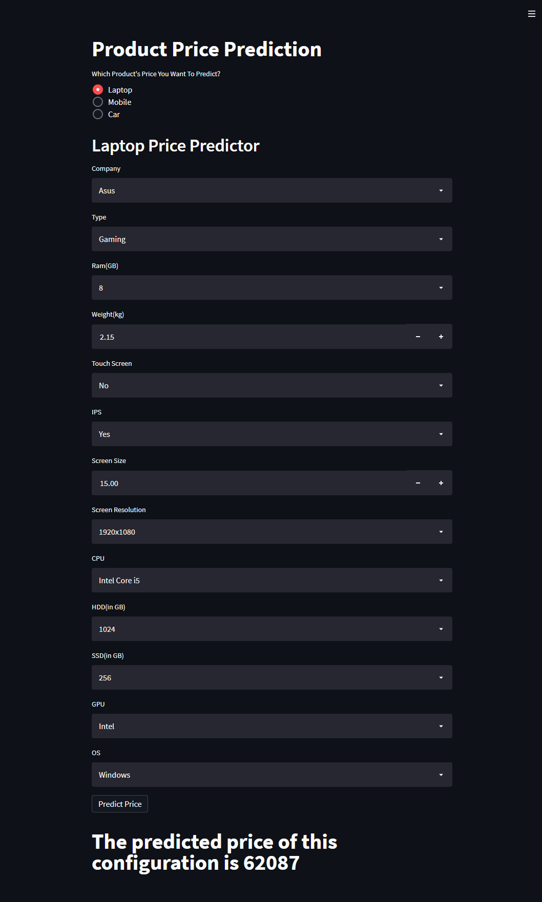
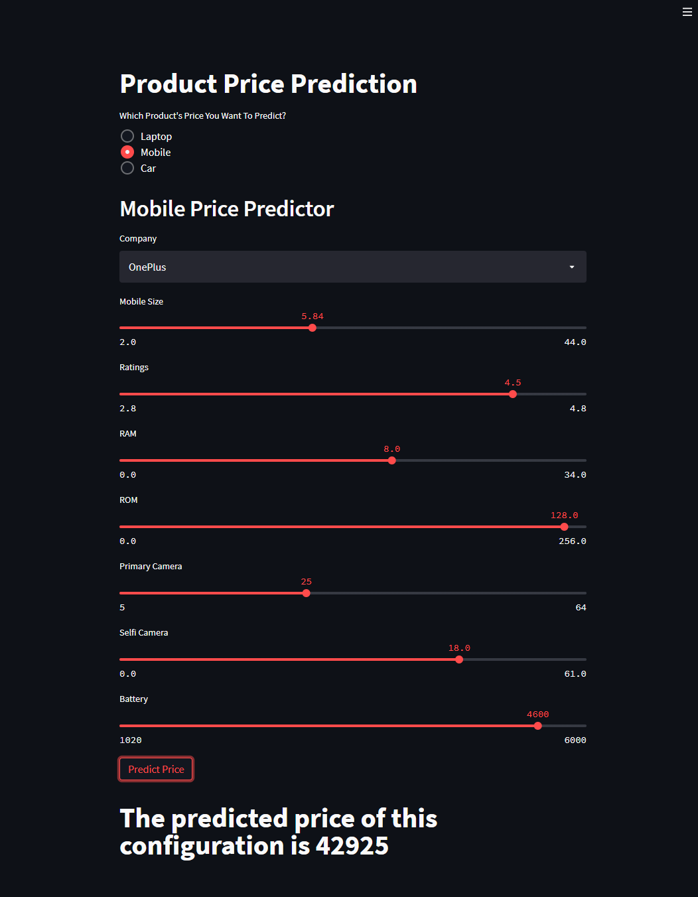
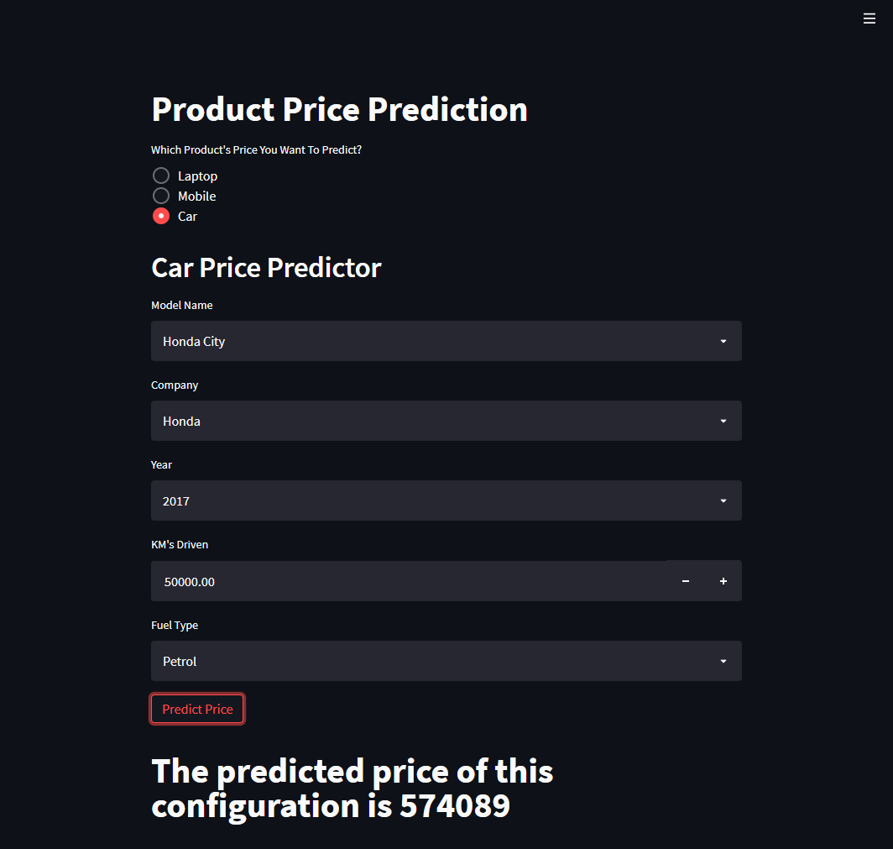

# Product-Price-Prediction
This is an complete end-to-end project where I had fused 3 different rergression problems statements into one web-application. In this project we can predict the price of 3 main products which are Laptop, Mobile and Car. Each of the project has almost 90% accuracy. The data used in this project is collected from various sources such as kaggle, github and techniques used such as web-scraping.

# CHECK OUT WEB-APPLICATION:

https://product-prices-prediction.herokuapp.com/

# TECHNOLOGIES USED:

- Python
- Anaconda
- Streamlit
- Heroku

# APPROCH & METHODOLOGY FOR THIS PROJECT:

First I deal with the Laptop price prediction since it has lot many features and this is the project which took most of the time, than I solved the Mobile price price prediction problem statement which was quite similar to the initial one, than I dive into Car price prediciton project which was completely new domain. Than I combine all of them into a single streamlit web-app.

# APPLICATION PREVIEW:

Example:

